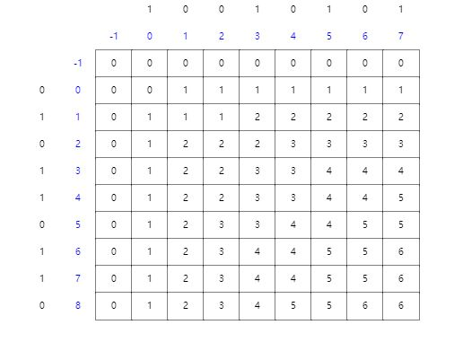

---
export_on_save:
    html: true
---
### CS624
### Assignment 4
### Prof. Nurit Haspel
### Yiwei Yao
---
#### 1. Solve the midterm, see attached pages.
---
#### 2. Exercise 15.4-1 in the text (page 396)(need change)
* LCS table: 
    
* result: ⟨1,0,0,1,1,0⟩
---
#### 3. Exercise 3.2 in the Lecture 8 handout.
* Given a left subtree $T^{left}$ of a optimal binary search tree T, and $T^{left}$ were not an optimal binary search tree, then there must be $E(T^{left*})$ has a better search cost than $E(T^{left})$ for a node $k_i$, then $E(T^{left*})=1+\sum_{i=1}^{n}p_idepth_{T^{left*}}(k_i) < E(T^{left})=1+\sum_{i=1}^{n}p_idepth_{T^{left}}(k_i)$, however it will contradict the assumption that T was a optimal binary search tree because $E(T)=1+\sum_{i=1}^{n}p_idepth_T(k_i)$, and $depth_T(k_i)=1+depth_{T^left}(k_i)$, so $depth_{T^left}(k_i)$ must be the smallest. Apply the same proof to the right subtree, it should be the same result. Therefore, If T is an optimal binary search tree and if T' is any subtree of T, then T' is an optimal binary search tree for its nodes.
---
#### 4. Exercise 3.3 in the Lecture 8 handout.
* Given a binary search tree with key {$k_i,...k_j$} and node {$k_r$}, we can find its two subtrees, left subtree with keys {$k_i,...,k_r-1$}, and right tree {$k_r+1,...,k_j$}. If we the left subtree and right subtree cannot form a contiguous sequence on each other then there must be a node $k_x$ for $i\leq x\geq r-1$ in right subtree or a node $k_y$ for $r+1\leq x\geq j$ in left subtree. However, it will contradict the assumption that T was a binary search tree. Therefore, the keys in any subtree can form a contiguous sequence.
---
#### 5. Exercise 15-2 (page 405).Longest palindrome subsequence
* Algorithm:
```
  longest_palindrome(A):
    L = A.length
    for i = 1 to A.length:
        A'[L] = A[i]. A' is the reverse array of A.
        L = L -1.
    b = LCS-LENGTH(A, A'). b is the LCS table
    PRINT-LCS(b. A, i, j)
```
* According to what we learned from the book we know that LCS-LENGTH runs $O(mn)$ times, in this case, $m=n$ so this step takes $O(n^2)$, PRINT-LCS takes $O(m+n)$ times, in this case, this step takes $O(2n)$ times. So, the running time for this algorithm to find longest palindrome subsequence is $O(n^2)$. 
---
#### 6.
* In the drawn graph above, there are edges {($v_1$,$v_2$), ($v_1$,$v_5$), ($v_2$,$v_4$), ($v_2$,$v_5$), ($v_3$,$v_4$), ($v_4$,$v_5$)}. According to the algorithm given, we find edge ($v_1$,$v_2$), and set w to $v_2$, L to $1$, find ($v_2$,$v_4$), set w to $v_4$, L to $2$, find ($v_4$,$v_5$) set w to $v_5$, L to $3$, then there is no edge out from $v_5$, so the longest path is $3$ which is true.
* In general, there could be a DAG that have edges{($v_1$,$v_2$), ($v_1$,$v_3$), ($v_3$,$v_4$), ($v_4$,$v_5$), ($v_2$,$v_5$)}, in this example, we find the longest path is $2$ that are {($v_1$,$v_2$), ($v_2$,$v_5$)}by using the algorithm above, however, it is wrong, the correct answer is $3$ that are {($v_1$,$v_3$), ($v_3$,$v_4$), ($v_4$, $v_5$)}.
* By considering all possible paths from $v_1$ to $v_n$, there will be exponentially many in $n$, and therefore it is impossible to compare them all if n is large, like $500$.
* Algorithm: 
$LongestPath()$
&emsp;Push $v_1$ into visited[]. visited[] is an array stores the vertex that has been visited.
&emsp;$w \leftarrow visited.pop$ w is the current node we are considering.
&emsp;For n elements in $distance[]$ do:
&emsp;&emsp;$distance[i] \leftarrow 0$. which initialize the distance from $v_1$ to $v_i$ to 0.
&emsp;For each edge out of w do:   
&emsp;&emsp;$distance[v_j]=MAX(distance[v_j], distance[w]+1)$
&emsp;&emsp;push $v_j$ into visited.
&emsp;&emsp;If there is no edge out of w anymore do:
&emsp;&emsp;&emsp; $w \leftarrow visited.pop$.
&emsp; return $distance[v_n]$
The algorithm keep track the max length of path from current vertex to the $v_1$ by storing and updating when we find a edge to the current vertex.
* It takes n times to initialize the distance value of each vertex at first, and then traversing all the edges that is a path or subpath from $v_1$ to $v_n$ to update the distance of each vertex to $v_1$ which is at most $E$ edges. Therefore, the running time is $O(|V|+|E|)$.
---
#### 7.
* Suppose that a given G was not the MST from $n_{ik}$ to $n_b$ Then there would be a less weight Q′. But then if we follow the original path from $n_1$ to $n_{ik}$ and then switch to the path Q′ from $n_{ik}$ to $n_b$, the total cost of all the edges on that path will be less than the cost of the original path P. And that is a contradiction because we assumed that P had the least cost of any path from $n_1$ to $n_b$.
* Assume that there is an MST T that does not contain e. Adding e to T will produce a cycle, that crosses the cut once at e and crosses back at another edge e' . Deleting e' we get a spanning tree T∖{e'}∪{e} of strictly smaller weight than T. This contradicts the assumption that T was a MST. 
* Suppose that $T$ is a MST that does contain a edge $E$ that $E$ is minimal edge from $a$ to $b$ in a cut, then we can find a new path $P$ from $a$ to $b$ instead $E$ that can form a MST. In this case, the path $P$ must have less cost than edge $E'$, however, it is a contradiction that according to the property of a cut that $E$ is the minimal edge in the cut and the weight of path $P$ must bigger than the edge $E$. Therefore, the lightest edge crossing the cut is a part of a minimum spanning tree.
* Suppose that $T$ is a MST that does contain a edge $E$ that $E$ is minimal edge from $a$ to $b$, then we can find a new path $P$ from $a$ to $b$ instead $E$ that can form a MST. However, it is a contradiction that $E$ is the lightest edge from $a$ to $b$, and the weight of $P$ must bigger than $E$.
---
#### 8.
* If $A$ is a maximum independent subset of tree $T$ containing $x$, then $A'$ is an independent subset excludes $x$ of $T'$ is subtree of $T$ excludes $x$. Assume $A'$ was not the maximum independent subset of tree T', then there must be a $A^*$ that is bigger than $A'$. However, it is a contradiction because if we add back $x$, then the maximum independent set will be larger than $A$.
* Let $A$ be a maximum independent set not containing all leaves of tree $𝑇$. Assume that $l\notin A$ for some leaf $l$ of 𝑇 and $v$ for its neighbor, If $v\notin A$, then 𝐼∪{𝑣} is independent, contradicting that $A$ is the maximum independent set. If $v\in A$, there is independent set $A^′=(𝐼-v)\cup {w}$ is an independent set same as $A$, however it is a contradict that when $T$ has two vertices the maximum independent set can be $l$ or $v$ and the size of it is one, when $T$ has more than two vertices, $v$ must have at least two degrees, so $A'$ cannot be the maximum independent set. Therefore, any leaf node v in a tree must be a part of a maximum size independent set.
* Algorithm:
```
max_independent_set(G): 
    while G is not empty:
        find the minimum node v with minimum degree
        push v into M. M is a list to store max independent set.
        remove v and its neighbors from G.
    end while
    return M.
```
* the algorithm goes over all nodes to find the node with minimum degree, then goes |V|- (neighbors of v + v) times to find the next minimum degree nodes. So the running time will be |V| + |V|- (neighbors of v + v) + |V|- (neighbors of v + v)-(neighbors of v' + v')+.... which should less than 2|v|. Therefore, the running time should be $O(|V|)$ and it is linear.
<div style="page-break-after: always;"></div>

### Midterm Exam 1 
#### 1. Order of growth.
(a) Base Case: $T(4) = d \leq c*4^2*log4=32c$ for the right choice of $c$.
(b) Inductive hypothesis: Assume $T(k) \leq ck^2logk$ for any $k < n$
(c) Substitute  in the equation to prove for $n$.
$T(n) \leq 16(c*(\frac{n}{4})^2log\frac{n}{4})+n^2$
$=cn^2*(logn-2)+n^2$
$=cn^2logn-n^2(2c-1)$
$\leq cn^2logn$ for every $c\geq 1/2$
#### 2. Sorting.
* Quick sort:
Using the example:$4,8_1,8_2,4$
Doing the partition we will remain the first 3 elements same after finishing the for-loop, and it will look like this:
$^p|4^i|8_1|8_2|4^r|$
For the step after for loop we need to switch $i+1$ and $r$. Which will change the order of equal value of keys and will be look like this:
$|4|4|8_2|8_1|$
* Heap Sort:
For example a max-heap looks like 
$3, 2, 1^1, 1^2, 0$. Doing a heap sort on this, it will extra the maximum number from the max-heap, and put into the last index in a new array, after doing it recursively, the sorted array will be $0, 1^2, 1^1, 2, 3$. It exchanges the position of same value, therefore it is not stable.
It does not preserve the order of elements and hence can't be stable
#### 3. Sorting:
* We can get the algorithm by modifying partition part in quick sort:
```
rearrange(A, p, r):
    x <- 0
    i <- p-1
    for j <- p to r do:
        if A[j] < x then
            i <- i+1
            exchange A[i] <-> A[j]
```
In the previous algorithm, it has the same run time as partition in quick sort and we know from the class that the run time is $O(n)$ because it runs maximum n times in the for loop.
#### 4. Heaps:
* Yes, it can.
* According to the definition of heaps. A min-heap is that the key at each node is less that or equal to the key in any descendant of that node which means for any node $i$, the value of node $2i$ and $2i+1$ must greater or equal to the value of node $i$. In other word, $i\leq 2i \leq 2i+1$ for any $i\geq 1$, a sorted array fits the property of min-heap which is that $i\leq i+1\leq i+2......$ for array $i\geq 1$ because $2i\geq i+1$ for $i\geq 1$.