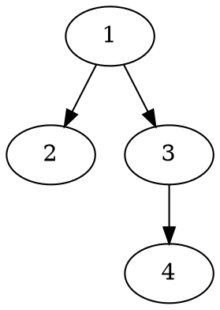

---
export_on_save:
    html: true
---
### CS624
### Assignment 6
### Prof. Nurit Haspel
### Yiwei Yao
------
#### 1.
* Prove by induction on a connected graph G:
* Base case:
    When there is only $1$ node in G, then BFS algorithm will begin at the only node and terminates at the same node since there is no child node. Therefore, the BFS tree will be a single node tree contains only one node which is true.
* Inductive hypothesis: 
    Assume algorithem $BFS(G,s)$ will create a BFS tree contains all nodes on $G$ with $k$ nodes $(k\geq1)$.
* Induction: 
    * To proof:
        In order to prove question, we have to show that $BFS(G',s)$ will create a BFS tree contains all nodes where $G'$ is a graph with adding a new node to graph $G$.
        Suppose $V'$ and $E'$is the nodes set and edge sets of graph $G'$, $V$ and $E$ is the original nodes set from $G$, then $V'=V+v_n$ where $v_n$ is the new node added to $G$ in $G'$, $E'= E+\{$edges that connect $v_n$ and the nodes in $V$ which should at least $1$ since $G'$ is a connected graph$\}$. If $v_n$ is the first node the algorithm visited, then there must be $v_i\in V$ connects to $v_n$, so we push $v_n$ into queue and mark $edge(v_n,v_i)$ as a "tree edge". Because we already mark $v_n$ as black, $v_n$ will not be pushed into queue again which means there will be loop in the final graph, what's more, since we assume that $G$ can create a BFS tree that contains all nodes by running BFS algorithm, we have showed that $G'$ will generate a BFS tree contains all nodes by BFS algorithm.  
#### 2.
  * The value of $d$ and $\pi$ from runing breadth-first search on the directed graph of Figure 22.2(a).

    | node | $d$      | $\pi$     |
    |------|----------|-----------|
    | 1    | $\infin$ | $\empty $ |
    | 2    | 3        | 4         |
    | 3    | 0        | $\empty $ |
    | 4    | 2        | 5         |
    | 5    | 1        | 3         |
    | 6    | 1        | 3         | 
    BFS on Figure 22.2(a) starting from vertex 3
    (a)&nbsp;&nbsp;&nbsp;&nbsp;&nbsp;&nbsp;&nbsp;&nbsp;&nbsp;&nbsp;&nbsp;&nbsp;&nbsp;&nbsp;&nbsp;&nbsp;&nbsp;&nbsp;&nbsp;&nbsp;&nbsp;&nbsp;&nbsp;&nbsp;&nbsp;&nbsp;&nbsp;&nbsp;&nbsp;&nbsp;&nbsp;&nbsp;(b)
    ```dot
    digraph G{
        forcelabels=true;
        {rank=same; 1 2 3 7 8 9}
        {rank=same; 4 5 6 10 11 12}
        1[xlabel=1, label= <&#x221E;>]
        2[xlabel=2, label= <&#x221E;>]
        3[xlabel=3, label= "0" style=filled, fillcolor=grey]
        4[xlabel=4, label= <&#x221E;>]
        5[xlabel=5, label= <&#x221E;>]
        6[xlabel=6, label= <&#x221E;>]
        1->{2,4}
        4->2
        2->5
        5->4[constraint=false];
        3->5
        3->6
        6->6
        7[xlabel=1, label= <&#x221E;>]
        8[xlabel=2, label= <&#x221E;>]
        9[xlabel=3, label= <<FONT COLOR="white">0</FONT>> style=filled, fillcolor=black]
        10[xlabel=4, label= <&#x221E;>]
        11[xlabel=5, label= "1", style=filled, fillcolor=grey]
        12[xlabel=6, label= "1", style=filled, fillcolor=grey]
        7->{8,10}
        10->8
        8->11
        11->10[constraint=false];
        9->11
        9->12
        12->12
    }
    ```
    (c)&nbsp;&nbsp;&nbsp;&nbsp;&nbsp;&nbsp;&nbsp;&nbsp;&nbsp;&nbsp;&nbsp;&nbsp;&nbsp;&nbsp;&nbsp;&nbsp;&nbsp;&nbsp;&nbsp;&nbsp;&nbsp;&nbsp;&nbsp;&nbsp;&nbsp;&nbsp;&nbsp;&nbsp;&nbsp;&nbsp;&nbsp;&nbsp;(d)
    ```dot
    digraph {
        forcelabels=true;
        1[xlabel=1, label= <&#x221E;>]
        2[xlabel=2, label= <&#x221E;>]
        3[xlabel=3, label= <<FONT COLOR="white">0</FONT>> style=filled, fillcolor=black]
        4[xlabel=4, label= <&#x221E;>]
        5[xlabel=5, label= "1", style=filled, fillcolor=grey]
        6[xlabel=6, label= <<FONT COLOR="white">1</FONT>>, style=filled, fillcolor=black]
        1->{2,4}
        4->2
        2->5
        5->4[constraint=false];
        3->5
        3->6
        6->6
        {rank=same; 1 2 3 7 8 9}
        {rank=same; 4 5 6 10 11 12}

        7[xlabel=1, label= <&#x221E;>]
        8[xlabel=2, label= <&#x221E;>]
        9[xlabel=3, label= <<FONT COLOR="white">0</FONT>> style=filled, fillcolor=black]
        10[xlabel=4, label= "2",style=filled, fillcolor=grey]
        11[xlabel=5, label= <<FONT COLOR="white">1</FONT>>, style=filled, fillcolor=black]
        12[xlabel=6, label= <<FONT COLOR="white">1</FONT>>, style=filled, fillcolor=black]
        7->{8,10}
        10->8
        8->11
        11->10[constraint=false];
        9->11
        9->12
        12->12
    }
    ```
    (e)&nbsp;&nbsp;&nbsp;&nbsp;&nbsp;&nbsp;&nbsp;&nbsp;&nbsp;&nbsp;&nbsp;&nbsp;&nbsp;&nbsp;&nbsp;&nbsp;&nbsp;&nbsp;&nbsp;&nbsp;&nbsp;&nbsp;&nbsp;&nbsp;&nbsp;&nbsp;&nbsp;&nbsp;&nbsp;&nbsp;&nbsp;&nbsp;(f)
    ```dot
    digraph {
        forcelabels=true;
        1[xlabel=1, label= <&#x221E;>]
        2[xlabel=2, label= "3", style=filled, fillcolor=grey]
        3[xlabel=3, label= <<FONT COLOR="white">0</FONT>> style=filled, fillcolor=black]
        4[xlabel=4, label= <<FONT COLOR="white">2</FONT>>,style=filled, fillcolor=black]
        5[xlabel=5, label= <<FONT COLOR="white">1</FONT>>, style=filled, fillcolor=black]
        6[xlabel=6, label= <<FONT COLOR="white">1</FONT>>, style=filled, fillcolor=black]
        1->{2,4}
        4->2
        2->5
        5->4[constraint=false];
        3->5
        3->6
        6->6
        {rank=same; 1 2 3 7 8 9}
        {rank=same; 4 5 6 10 11 12}

        7[xlabel=1, label= <&#x221E;>]
        8[xlabel=2, label= <<FONT COLOR="white">3</FONT>>, style=filled, fillcolor=black]
        9[xlabel=3, label= <<FONT COLOR="white">0</FONT>> style=filled, fillcolor=black]
        10[xlabel=4, label= <<FONT COLOR="white">2</FONT>>,style=filled, fillcolor=black]
        11[xlabel=5, label= <<FONT COLOR="white">1</FONT>>, style=filled, fillcolor=black]
        12[xlabel=6, label= <<FONT COLOR="white">1</FONT>>, style=filled, fillcolor=black]
        7->{8,10}
        10->8
        8->11
        11->10[constraint=false];
        9->11
        9->12
        12->12
    }
    ```
#### 3.
* According to the Theorem 1.6 in the lecture note 12 that If $G$ is connected, then the breadth-first search tree gives the shortest path from the root to any node, we know that whatever order of a vertex $u$ appear in a adjacency list, the value of $u.d$ will not change afterall.
* On the other hand, the breadth-first tree computed by BFS can depend on the ordering within adjacency lists. In the figure 22.3, after the step that find the adjacency vertices of w, if we choose node $x$ to traveral first then $u.\pi=x$ which is different to figure 22.3 which has $u.\pi=t$.  
#### 4.
* According to the definition of a full binary tree, assume $T$ has n nodes and each node has two children except leaves. The number of nodes in $T$ are $n$, number of nodes with $2$ children are $n_x$, leaves are $n_l$ 
* Base case: 
  when $n$ is $1$ which is a binary tree with only root. $l=1$, $n_x=0$. It is true that $l-1=n_x=>1-1=0$
* Inductive hypothesis:
  For any full binary tree with $n_x\leq k$, then $n_l=n_x-1$.
* Induction :
  * To proof:
    In order to prove question, we have to show that for $n=k+1$ that $n_l=n_x-1$
  * First case: suppose a full binary tree $T'$ with $n'=k+1$ and has only left subtree $T_l'$, in this case, the nodes with two children $n_{x}'$ in $T'$ equals to $k$ since the root of $T'$ is neither a internal node with two childern or a leaf, using the inductive hypothesis, we have showed that for $n=k+1$ that $n_l=n_x-1$.
  * Second case: suppose a full binary tree $T'$ with $n'=k+1$ and has only right subtree $T_r'$, using the same method in the first case, we can prove it.
  * Third case: suppose a full binary tree $T'$ with $n'=k+1$ and has both non-empty left subtree $T_{left}'$ and right subtree $T_{right}'$. In this case, $n_l=n_{left-l}+n_{right-l}$, $n_x=n_{left-x}'+n_{right-x}'+1(root)$ since the root of $T'$ must have two degrees. Because $n_{left}'$ and $n_{right}'$ must less than $k$, using the inductive hypothesis, we know that $n_{left-l}' = n_{left-x}'+1$ and $n_{right-l}' = n_{right-x}'+1$. Thus, $n_l=n_l'=n_{left-x}'+1+n_{right-x}'+1=n_x+1$ which is also true. 
#### 5.
  *  parenthesis structure of the depth-first search of Figure 22.4 is $(u(v(y(xx)y)v)u)(w(zz)w)$
#### 6.
  * counter example:
    ```dot
        digraph {
            forcelabels=true;
            1[label= <1>]
            2[label= <2>]
            3[label= <3>]
            1->2
            2->1
            1->3
            {rank=same; 2 3}
        }
        ```
  * In this example, DFS algorithm starts from node $1$, $1.d=1$. Then $2.d=2$, after finished node $2$, algorithm go to node $3$, and set node $3.d$ equals to $4$ and finished it then return to node$1$ and finished the DFS algorithm. we can see in this example that $3.d\le 2.d$ but node $3$ is not the descendant of node $2$.
#### 7.
* When we do a DFS on a directed tree and starts from one of the leaves, there will be end up a depth-first tree contains only one of the internal nodes, which have both income and outcome edges.
* For example:
Tree T:

In the previous tree, we starts from the leaf node $4$, then there will be a DFS tree only cotains node $3$, and node $3$ have both income and outcome edges. 

  